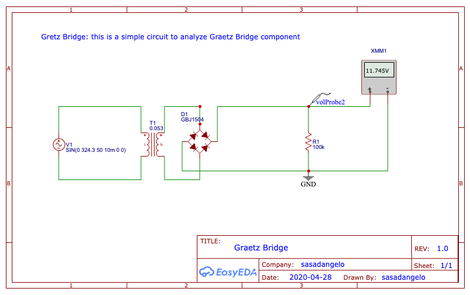

# Graetz Bridge

This project builds upon a previous one:

[Simple Transformer Circuit](simple-transformer.md)

The goal is to convert a typical Italian mains power source of 230V AC at 50Hz into a lower DC voltage using a step-down transformer and a Graetz bridge (full-wave rectifier). The circuit illustrates how theoretical calculations compare with real-world measurements, especially focusing on the voltage drop across the diodes under various load conditions.

[Click here](https://oshwlab.com/sasadangelo/graetzbridge) to access the EasyEDA circuit.

[Click here](https://tinyurl.com/287jktln) to access the Falstad circuit.

## Schema



## Circuit Description

The circuit consists of:

* **Power Source**: 230V AC, 50Hz
* **Transformer**: Steps down the voltage to 12V AC using a turns ratio of 0.053 (12/230)
* **Graetz Bridge (Full-Wave Rectifier)**: Converts AC to pulsating DC, allowing only positive voltages by inverting the negative half of the waveform
* **Load Resistor**: Variable resistance to simulate different current draws
* **Voltage Probes**: Used to measure waveforms and voltages before and after the rectifier

## Circuit Description

The transformer outputs 12V RMS AC, which corresponds to a peak voltage of:

```
Vpt = Vrms * √2 = 12V * √2 ≈ 16.97V
```

After passing through the Graetz bridge, the signal undergoes a voltage drop due to the diodes. For ideal diodes with a 0.7V drop each, the total drop is 1.4V:

```
Vpout = Vpt - 1.4V ≈ 15.57V
Voutrms = Vpout / √2 ≈ 11V
```

However, real components behave slightly differently due to tolerances and current dependency.

## Circuit Calculation

In the actual simulation:

* The transformer outputs 12.115V RMS, leading to:

```
Vpt = 12.115V * √2 ≈ 17.13V
```

* According to the Graetz bridge datasheet ([DS21219](https://www.diodes.com/assets/Datasheets/ds21219.pdf)), the forward voltage drop per diode is up to 1.05V (Vfm max), depending on current.

* Measurements with voltage probe volProbe1 show that the output waveform loses about 0.5V on the peak due to diode drops and grounding effects. This gives:

```
Vpout = 17.13V - 1.05V ≈ 16.1V
Voutrms = 16.1V / √2 ≈ 11.37V
```

[Voltage Drop on Graetz Bridge - EasyEDA Forum](https://easyeda.com/forum/topic/Voltage-drop-on-graetz-81f36e9708af49e3b49753ca91f85c85)

## Design Insights

To analyze how the output voltage varies with different loads, several resistors were tested:

Resistor | Vpout (V) | Voutrms (V) | Iout (A) | Vdrop (V)
----------------------------------------------------------
10 Ω	   |   15.45	 |    10.72    |	1.00	  |    1.42  |
100 Ω	   |   15.73	 |    10.98	   |  0.10	  |    1.14  |
1 kΩ	   |   16.08	 |    11.24	   |  0.011	  |    0.79  |
10 kΩ	   |   16.20	 |    11.49	   |  0.0011	|    0.67  |
100 kΩ	 |   16.59	 |    11.74	   |  0.000117|    0.30  |

## Real-World Testing

As expected, the diode voltage drop increases with the current drawn by the load. At high currents (low resistances), the drop approaches the ideal 1.4V. At low currents (high resistances), the drop remains closer to the datasheet value of 1.05V or even lower. This confirms the current-dependent nature of diode forward voltage.

## Conclusion

This project demonstrates the importance of accounting for real-world behavior when designing power electronics. While theoretical values provide a solid starting point, practical results—especially those influenced by diode forward voltage and load current—can vary significantly. Simulation tools and real measurements both play a crucial role in validating and refining the design.


