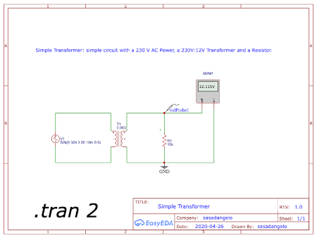
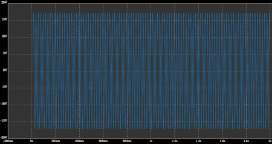

# Simple Transformer Circuit

This is a simple project I created to test how transformers work in EasyEDA after a long break from electronics. The goal is to understand the basic behavior of a transformer and how it converts high AC voltage into a lower, safer value for use in circuits.

[Click here](https://oshwlab.com/sasadangelo/transformer) to access the EasyEDA circuit.

## Schema

## Circuit Description

A transformer is a passive electrical device made of two inductively coupled coils: the primary and secondary. When alternating current (AC) flows through the primary coil, it generates a magnetic field that induces a voltage in the secondary coil. This allows us to change the voltage level without direct electrical connection.

- **Primary coil**: Connected directly to the AC mains (e.g., 230V in Italy).
- **Secondary coil**: Connected to the load or circuit.

Both coils are usually wrapped around a common iron core to enhance magnetic coupling.

## Circuit Calculation

If the primary has N = 1000 turns, then the voltage per turn is:

**Voltage per turn** = 230V / 1000 = 0.23V

To obtain an output of 12V, we need:

**Turns on secondary** = 12V / 0.23V ≈ 52.17 → ~53 turns

The turns ratio becomes:

**Turns ratio** = 53 / 1000 = 0.053

In AC circuits, voltages are often given in RMS (Root Mean Square), which is a measure of effective voltage. To understand the waveform fully, we need to calculate the **peak** (Vp) and **peak-to-peak** (Vpp) voltages. If the RMS voltage on the secondary is 12V, then:

**Peak voltage (Vp)** = RMS × √2 ≈ 12V × 1.414 ≈ 16.97V
**Peak-to-peak voltage (Vpp)** = 2 × Vp ≈ 2 × 16.97V ≈ 33.94V

So:

**Vp (peak)** ≈ 16.97V

**Vpp (peak-to-peak)** ≈ 33.94V

The following figure shows the wave form of the voltage on the resistor:

## Design Insights

- This simulation assumes ideal transformer behavior, with no power loss.
- Real transformers have additional characteristics like core losses, leakage inductance, and winding resistance, which are not modeled here.
- This is a step-down transformer, reducing voltage from a high level to a lower one.

## Real-World Testing

If you replicate this circuit with actual components, expect some variations:

- Real AC mains may fluctuate slightly above or below 230V.
- The output voltage will depend on load resistance and transformer quality.
- Cheap or small transformers may introduce voltage drops under load.

## Conclusion

This simple transformer model helps understand the principle of voltage conversion using magnetic induction. By adjusting the turn ratio, you can simulate different transformer behaviors in EasyEDA. It's a great starting point for more advanced power supply design or AC applications.
